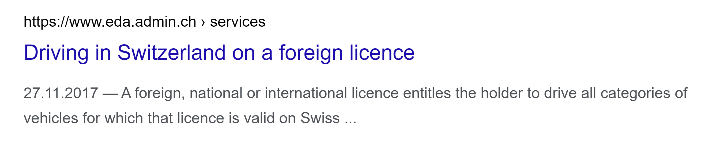
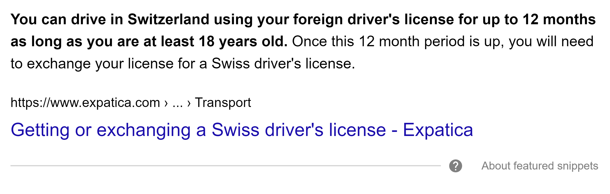
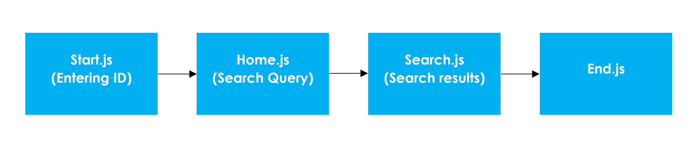

# Davfon-results
Results is a react-based web application to conduct experiments on web search behavior.

[Track Behavioral Data](#track-behavioral-data)<br />
[Creating search results](#creating-search-results)<br />
[Creating featured snippets](#creating-featured-snippets)<br />
[Navigation](#navigation)<br />
[Firebase](#firebase)

## Track Behavioral Data
The Results Web Application can track:
- search term
- total search time
- clicks on search results with timestamp

Results saves the tracked data into text files, which are stored in [Firebase](#firebase).

## Creating search results



To create a search result you can use the template below. Simply add it inside the App-body div in Search.js:

```html
<div className='search-result'>
    <div className='grey-link' onClick={() => handleClick(firstLink, 1)} >   
        https://www.eda.admin.ch › services
    </div>
    <div className='blue-link' onClick={() => handleClick(firstLink, 1)} >
        Driving in Switzerland on a foreign licence
    </div>
    <p className='text'>
        27.11.2017 — A foreign, national or international licence entitles the
        holder to drive all categories of vehicles for which that licence is
        valid on Swiss ...
    </p>
</div>
```

Make sure to change the link and result rank in the handleClick function. (0 = featured snippet, 1 = first result, ...)

## Creating featured snippets



To create a featured snippet you can use the template below. Simply add it inside the App-body div in Search.js:

```html
<div className='featured-snippet'>
    <p className='featured-text'>
        <b>You can drive in Switzerland using your foreign driver's license for up to 12 months as long as you are at least 18 years old.</b> Once this 12 month period is up, you will need to exchange your license for a Swiss driver's license.
    </p>
    <div className='grey-link' onClick={() => handleClick(featuredLink, 0)} >
        https://www.expatica.com › ... › Transport
    </div>
    <div className='blue-link' onClick={() => handleClick(featuredLink, 0)} >
        Getting or exchanging a Swiss driver's license - Expatica
    </div>
    <div className='footnote'>
        <div className='separation-line'/>
        <div className='help-icon'>
            <HelpIcon className='help-icon-svg'/>
        </div>
        <div className='footnote-text'>
            About featured snippets
        </div>
    </div>
</div>
```

Make sure to change the link and result rank in the handleClick function. (0 = featured snippet, 1 = first result, ...)

## Navigation


Navigation can be customized in App.js and through the navigate() function in each File. 

## Firebase
### Setup Firebase
[Here](https://www.youtube.com/watch?v=xUKIQAIOfrU) is a tutorial on how to setup a firebase storage instance. You can find the firebaseConfig in Search.js and edit it accordingly.

### Download from Firebase
To download the whole storage bucket you can use [gsutil](https://cloud.google.com/storage/docs/gsutil/commands/cp)
```
gsutil -m cp -R gs://<bucket_name>
```

## Getting Started with Create React App

This project was bootstrapped with [Create React App](https://github.com/facebook/create-react-app).

## Available Scripts

In the project directory, you can run:

### `npm start`

Runs the app in the development mode.\
Open [http://localhost:3000](http://localhost:3000) to view it in your browser.

The page will reload when you make changes.\
You may also see any lint errors in the console.

### `npm test`

Launches the test runner in the interactive watch mode.\
See the section about [running tests](https://facebook.github.io/create-react-app/docs/running-tests) for more information.

### `npm run build`

Builds the app for production to the `build` folder.\
It correctly bundles React in production mode and optimizes the build for the best performance.

The build is minified and the filenames include the hashes.\
Your app is ready to be deployed!

See the section about [deployment](https://facebook.github.io/create-react-app/docs/deployment) for more information.

### `npm run eject`

**Note: this is a one-way operation. Once you `eject`, you can't go back!**

If you aren't satisfied with the build tool and configuration choices, you can `eject` at any time. This command will remove the single build dependency from your project.

Instead, it will copy all the configuration files and the transitive dependencies (webpack, Babel, ESLint, etc) right into your project so you have full control over them. All of the commands except `eject` will still work, but they will point to the copied scripts so you can tweak them. At this point you're on your own.

You don't have to ever use `eject`. The curated feature set is suitable for small and middle deployments, and you shouldn't feel obligated to use this feature. However we understand that this tool wouldn't be useful if you couldn't customize it when you are ready for it.

